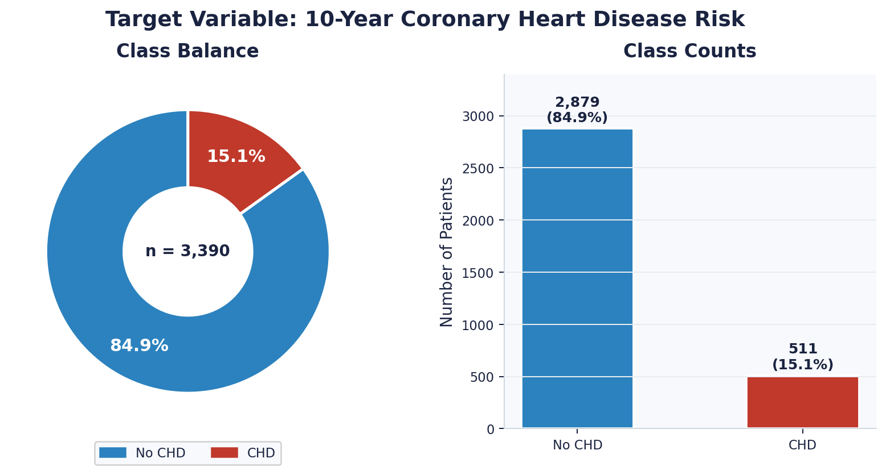
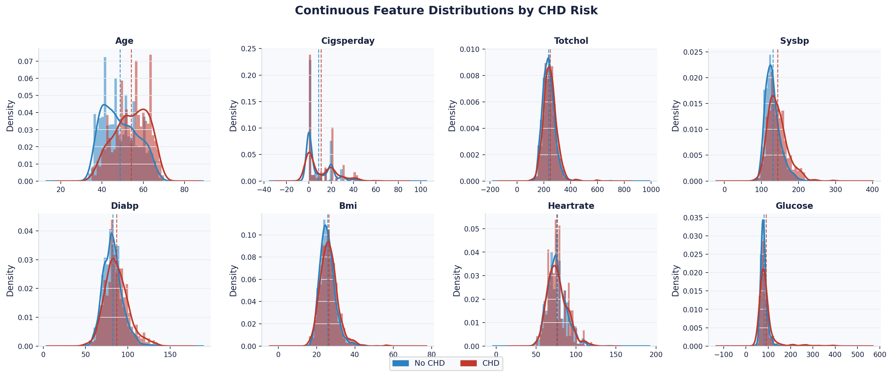
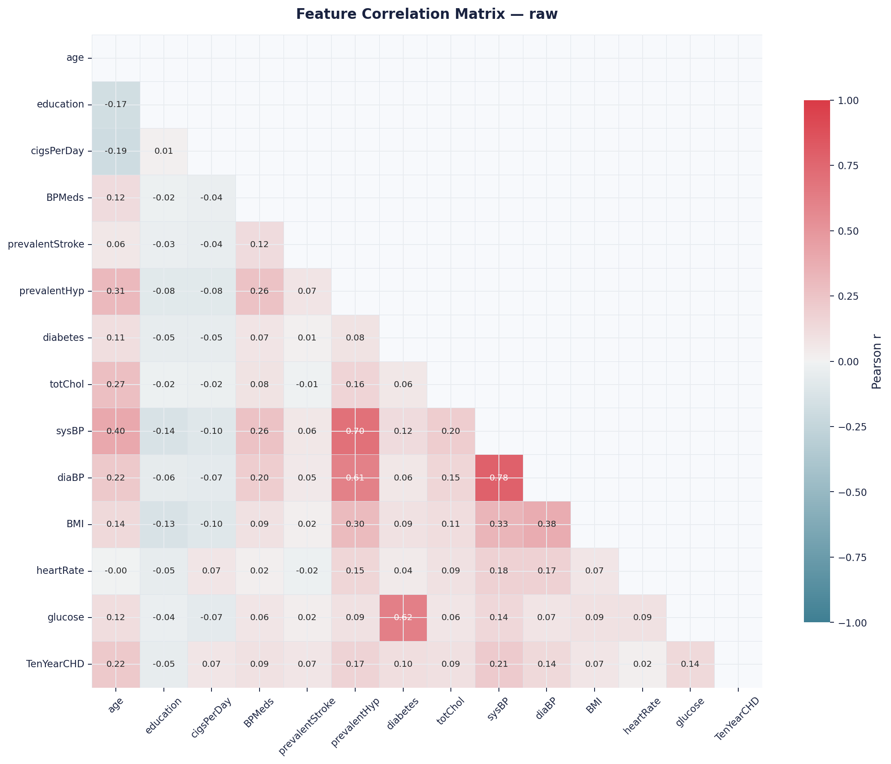
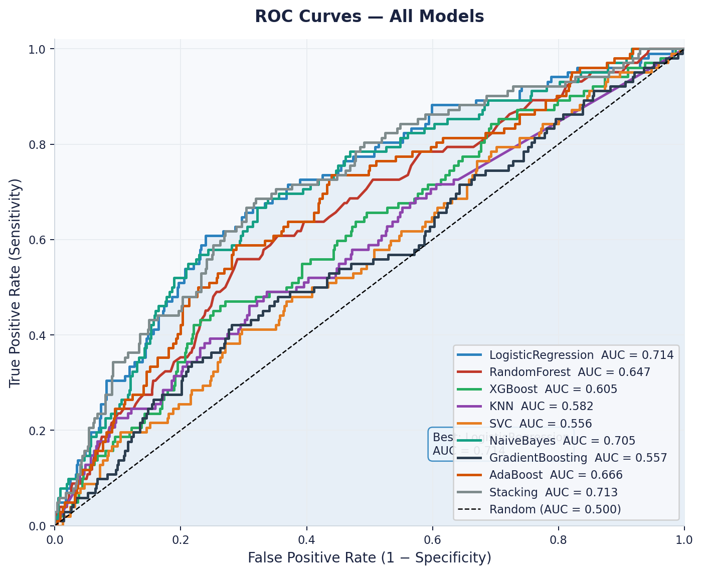
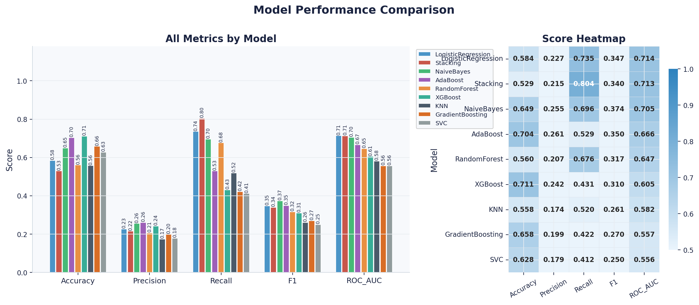
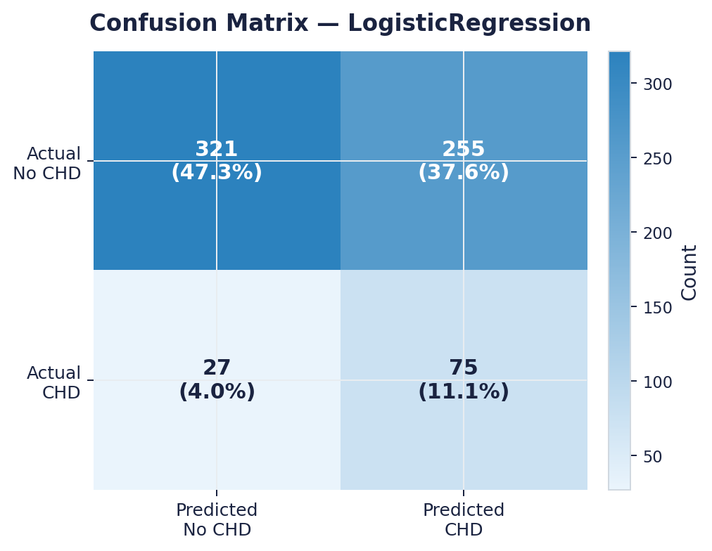
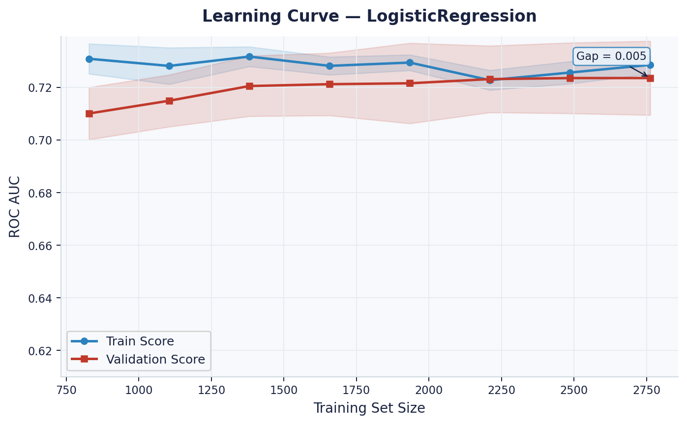
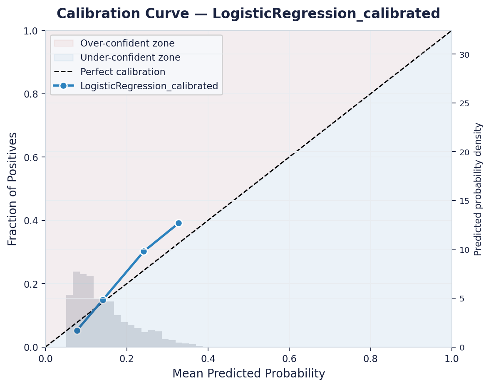

# Cardiovascular Disease Risk Prediction
### 10-Year CHD Risk Assessment · Framingham Heart Study · Machine Learning

---

## Overview

This project builds an end-to-end machine learning pipeline to predict an individual's **10-year risk of coronary heart disease (CHD)** using clinical and demographic data from the Framingham Heart Study cohort.

The pipeline covers everything from raw data to a deployed web application — leakage-safe preprocessing, nine trained classifiers, threshold optimisation, probability calibration, and a production FastAPI backend with a single-page web UI.

> **Live Demo:** Deployed on Render — [cardiovascular-risk-predictor.onrender.com](https://cardiovascular-risk-predictor.onrender.com)
>
> **Technical Report:** See [`TECHNICAL_DOCUMENTATION.md`](TECHNICAL_DOCUMENTATION.md) or [`Cardiovascular_Risk_Prediction_Technical_Report.pdf`](Cardiovascular_Risk_Prediction_Technical_Report.pdf)

---

## Dataset

| Property | Detail |
|---|---|
| Source | Framingham Heart Study (Kaggle) |
| Patients | 3,390 |
| Features | 15 clinical + demographic |
| Target | `TenYearCHD` — binary (0 = No CHD, 1 = CHD within 10 years) |
| Class balance | ~84.9% No CHD / ~15.1% CHD (heavily imbalanced) |

**Features used:**

| Category | Features |
|---|---|
| Demographics | `age`, `sex`, `education` |
| Lifestyle | `is_smoking`, `cigsPerDay` |
| Medical history | `BPMeds`, `prevalentStroke`, `prevalentHyp`, `diabetes` |
| Clinical measurements | `totChol`, `sysBP`, `diaBP`, `BMI`, `heartRate`, `glucose` |

---

## Exploratory Data Analysis

### Class Distribution

The dataset is heavily imbalanced — only **511 patients (15.1%)** developed CHD within 10 years, making class imbalance handling a critical design consideration.



### Continuous Feature Distributions by CHD Outcome

CHD-positive patients (red) show notably higher distributions for **age**, **systolic BP**, **glucose**, and **cigarettes per day** compared to CHD-negative patients (blue). These features emerge as the strongest discriminators.



### Feature Correlation Matrix

**Systolic and diastolic BP** show the highest inter-feature correlation (~0.78), which motivates engineering a `pulsePressure = sysBP − diaBP` feature and removing one of the originals to reduce multicollinearity.



---

## Pipeline

### 1. Preprocessing (leakage-safe)

All fitting is done on the **training fold only** — never the validation or test sets.

```
Raw data
  → Stratified 3-way split (train 60% / val 20% / test 20%)
  → Median/mode imputation       (fitted on X_train)
  → One-hot encoding             (sex, is_smoking)
  → Feature engineering — Phase 1 (deterministic):
      · Pulse pressure  (sysBP − diaBP)
      · Age group bins  (ACC/AHA clinical bands: <40, 40–50, 50–60, ≥60)
      · BMI flags       (is_obese, is_overweight)
      · Smoking intensity interaction term (is_smoking × cigsPerDay)
      · log1p transforms on skewed continuous features
  → IQR outlier clipping         (fitted on X_train)
  → Low-variance / high-correlation feature removal (fitted on X_train)
  → StandardScaler               (fitted on X_train)
  → SMOTE oversampling           (training fold only)
```

### 2. Model Training

Nine classifiers trained with `GridSearchCV` (stratified 5-fold, AUC scoring):

| Model | Hyperparameters Searched |
|---|---|
| Logistic Regression | C, l1_ratio, solver |
| Random Forest | n_estimators, max_depth, min_samples_split, min_samples_leaf |
| XGBoost | max_depth, learning_rate, n_estimators, subsample, colsample_bytree |
| KNN | n_neighbors, weights, metric |
| SVC | C, kernel |
| Naive Bayes | var_smoothing |
| Gradient Boosting | n_estimators, learning_rate, max_depth, subsample |
| AdaBoost | n_estimators, learning_rate |
| Stacking Ensemble | Top-3 AUC models as base learners · Logistic Regression meta-learner |

### 3. Threshold Optimisation

Thresholds are tuned on the **validation set** (never the test set) by maximising **F2-score** (recall weighted 2× over precision) subject to a minimum precision floor of 20%.

> Pure recall maximisation is degenerate — it flags every patient as positive, driving the threshold to zero. F2 + precision floor gives the right clinical trade-off: catching most sick patients while avoiding useless referrals.

### 4. Probability Calibration (Platt Scaling)

The best model is post-processed with **Platt scaling** — a logistic regression fitted on held-out validation probabilities. This ensures a predicted "30% risk" reflects a real-world ~30% event frequency, which is essential for clinical communication.

---

## Results

### Best Model: Logistic Regression (Platt-calibrated)

| Metric | Value |
|---|---|
| ROC-AUC | **0.714** |
| Sensitivity (Recall) | **72.6%** |
| Specificity | **58.0%** |
| Decision Threshold | **0.18** |

### ROC Curves — All Models

Logistic Regression achieves the highest AUC (0.714), followed closely by Stacking (0.713) and Naive Bayes (0.705). All models comfortably outperform random chance (AUC = 0.500).



### Model Performance Comparison

The heatmap (right) shows Logistic Regression leading on both ROC-AUC and balanced recall/precision. Stacking achieves higher recall but slightly lower AUC.



### Confusion Matrix — Logistic Regression

On the held-out test set (678 patients), the model correctly identifies **75 out of 102 CHD cases** (73.5% recall) while generating 255 false positives. For a screening tool, catching 73.5% of true cases is the primary objective.



### Learning Curve

The training/validation AUC gap converges to just **0.005**, confirming the model is not overfitting. The flat validation curve from ~1,000 samples onward indicates the model has effectively extracted the available signal from the dataset.



### Calibration Curve — Post-Platt Scaling

After Platt scaling, the model's predicted probabilities closely follow the perfect calibration diagonal, confirming the output scores are interpretable as true event frequencies.



### All Model Comparison (test set, threshold-tuned)

| Model | AUC | Recall | Precision | F1 | Threshold |
|---|---|---|---|---|---|
| **LogisticRegression** | **0.714** | 73.5% | 22.7% | 0.347 | 0.42 |
| Stacking | 0.713 | 80.4% | 21.5% | 0.340 | 0.26 |
| NaiveBayes | 0.705 | 69.6% | 25.5% | 0.374 | 0.37 |
| AdaBoost | 0.666 | 52.9% | 26.1% | 0.350 | 0.49 |
| RandomForest | 0.647 | 67.6% | 20.7% | 0.310 | 0.23 |
| XGBoost | 0.605 | 43.1% | 24.2% | 0.311 | 0.10 |
| KNN | 0.582 | 51.9% | 17.4% | 0.261 | 0.29 |
| GradientBoosting | 0.557 | 42.2% | 19.9% | 0.270 | 0.10 |
| SVC | 0.556 | 41.2% | 17.9% | 0.250 | 0.15 |

> AUC ~0.71 is a strong result for a tabular medical dataset with 15% class prevalence and 15 raw features.

---

## Web Application

The FastAPI backend serves a fully self-contained single-page HTML/JS interface at `GET /`.

**Features:**
- Age slider with large typographic display
- Segmented sex toggle + education selector
- Animated binary switches for 5 medical history conditions
- Conditional cigarettes/day field (appears only when smoker is active)
- Semicircular probability gauge — colour-coded Low / Moderate / High
- Per-factor risk breakdown table with clinical reference ranges
- Tailored clinical recommendations generated from the risk profile
- Offline demo mode — falls back to a client-side logistic approximation when the API is unreachable

### Run locally

```bash
uvicorn app_api:app --host 0.0.0.0 --port 8000 --reload
```

Open `http://localhost:8000`

### API Endpoints

| Method | Endpoint | Description |
|---|---|---|
| `GET` | `/` | Serves the web UI |
| `GET` | `/health` | Returns model name + server status |
| `POST` | `/predict` | Single-patient CHD probability |
| `POST` | `/predict/batch` | Batch prediction for multiple patients |

Interactive docs: `http://localhost:8000/docs`

**Example request:**
```bash
curl -X POST http://localhost:8000/predict \
     -H "Content-Type: application/json" \
     -d '{"age":55,"sex":1,"is_smoking":0,"cigsPerDay":0,"BPMeds":0,
          "prevalentStroke":0,"prevalentHyp":1,"diabetes":0,
          "totChol":250,"sysBP":140,"diaBP":90,"BMI":28.5,
          "heartRate":75,"glucose":100,"education":2}'
```

**Example response:**
```json
{
  "model_name": "LogisticRegression",
  "threshold": 0.18,
  "chd_probability": 0.3142,
  "chd_prediction": 1,
  "risk_label": "High Risk"
}
```

---

## Project Structure

```
├── app_api.py                               # FastAPI backend (serves UI + prediction API)
├── app_streamlit.py                         # Alternative Streamlit UI (local use)
├── Cardiovascular Risk Assessment.html      # Web UI (served at GET /)
├── render.yaml                              # Render free-tier deployment config
├── generate_pdf.py                          # PDF report generator
├── requirements.txt                         # Runtime dependencies
├── TECHNICAL_DOCUMENTATION.md              # Full methodology write-up
├── Cardiovascular_Risk_Prediction_Technical_Report.pdf
├── models/
│   └── best_model_bundle.joblib             # Trained model + all preprocessing artifacts
├── src/
│   ├── config.py                            # Paths, hyperparameter grids, column lists
│   ├── data_loader.py                       # CSV loading and basic EDA
│   ├── preprocessing.py                     # Imputation, encoding, scaling, SMOTE
│   ├── feature_engineering.py              # Pulse pressure, age groups, BMI flags, log transforms
│   ├── models.py                            # Model registry, GridSearchCV, stacking, calibration
│   ├── evaluation.py                        # Metrics, cross-validation, DCA
│   ├── visualization.py                     # All report charts
│   ├── train.py                             # End-to-end training pipeline
│   └── predict.py                           # CLI inference
└── reports/                                 # Auto-generated charts and CSVs from train.py
```

---

## Setup

```bash
# Clone the repo
git clone https://github.com/AkshayAI007/Cardiovascular-disease-risk-prediction-using-Machine-learning.git
cd Cardiovascular-disease-risk-prediction-using-Machine-learning

# Create virtual environment
python -m venv venv
venv\Scripts\activate          # Windows
# source venv/bin/activate     # macOS / Linux

# Install dependencies
pip install -r requirements.txt

# Train the model (generates model bundle + all report charts)
python src/train.py

# Launch the API + web UI
uvicorn app_api:app --host 0.0.0.0 --port 8000 --reload
```

---

## Deployment (Render — Free)

1. Push this repo to GitHub
2. Go to [render.com](https://render.com) → New → Web Service → connect repo
3. Render auto-detects `render.yaml` → click **Deploy**

Start command: `uvicorn app_api:app --host 0.0.0.0 --port $PORT`

---

## Key Design Decisions

| Decision | Rationale |
|---|---|
| Three-way split (train / val / test) | Threshold tuning uses val set; test set is touched only once — no leakage |
| SMOTE on training fold only | Synthetic samples must never appear in val/test — that would inflate metrics artificially |
| F2 threshold optimisation | Medical screening prioritises recall; F2 + precision floor prevents degenerate "flag everyone" solution |
| Platt calibration | Raw model scores are not probabilities; calibration makes them meaningful for clinical communication |
| Logistic Regression as winner | Highest AUC, well-calibrated, interpretable — the right choice for a clinical risk tool |
| `device="cpu"` for XGBoost | Dataset (~3,000 rows) is too small for GPU; mixed device training caused unnecessary warnings |

---

## Disclaimer

This is a research and portfolio project. The model and application **do not constitute medical advice** and must not replace clinical judgement. Predictions should only be used to support, not substitute, the assessment of a qualified healthcare professional.
